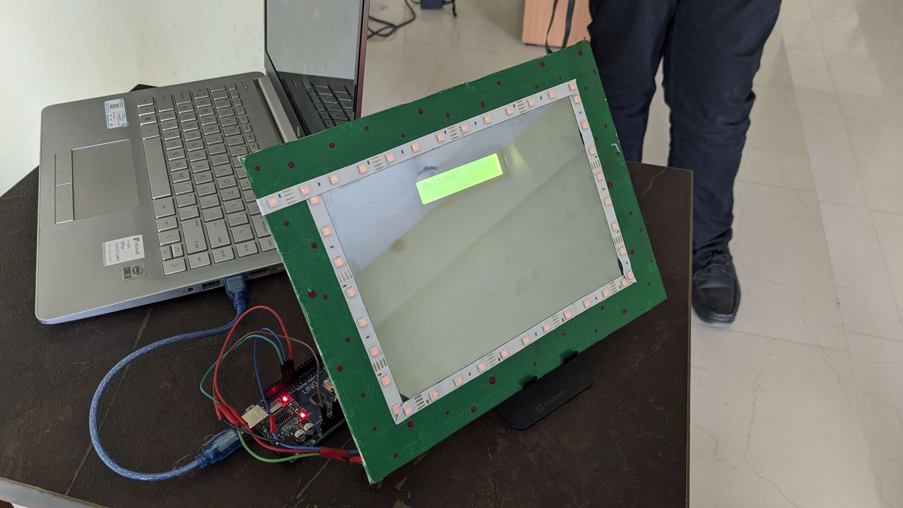

# Smart Mirror Assistant

This project is a Smart Mirror system that uses speech recognition, NLP, and Arduino integration to display information such as time, date, weather, news, and motivational quotes. The system listens for voice commands and displays the requested information on a connected Arduino-powered mirror.

## Features

-   Speech recognition for hands-free operation
-   Displays time, date, and day
-   Fetches current weather and top news headlines
-   Shows motivational quotes
-   Communicates with Arduino for display

## Requirements

### Software

-   See `requirements.txt` for Python dependencies.
-   Install `LiquidCrystal.h` for Arduino.

### Hardware

-   LCD Display
-   See through mirror
-   Arduino UNO
-   Microphone & Webcam (Laptop)

## Usage

1. Connect your Arduino to the specified USB port.
2. Ensure your camera and microphone are connected.
3. Install dependencies:

    ```bash
    pip install -r requirements.txt
    ```

4. Run the main script:

    ```bash
    python main.py
    ```

## File Structure

-   `main.py`: Main application script
-   `requirements.txt`: Python dependencies
-   `arduino/arduino.ino`: Arduino code

## Notes

-   Update the Arduino serial port in `main.py` if needed.
-   API keys for weather and news are hardcoded; replace with your own if required.
-   Requires internet connection for weather, news, and quotes.
-   🏆 Secured **2nd** Place in **Chrysalis: Digital Design & Computer Organization Exhibition** held in Atria Institute of Technology.

## Model



---
